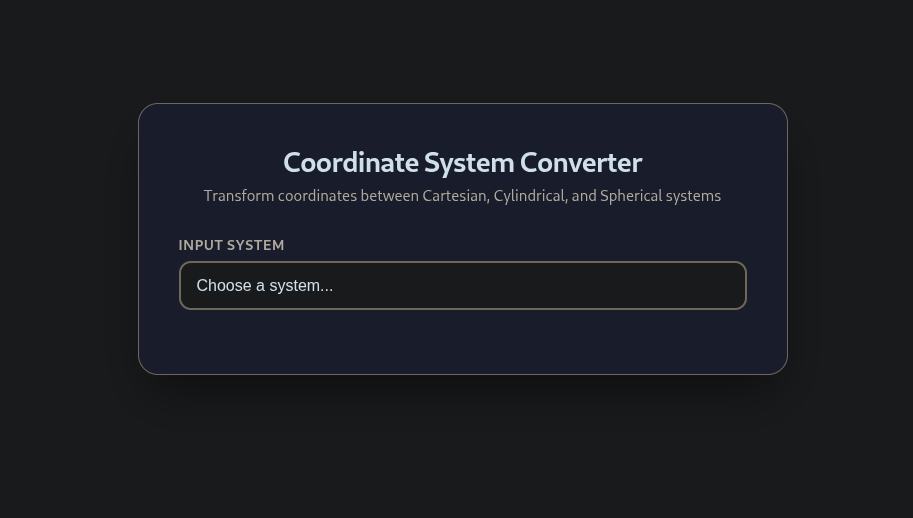
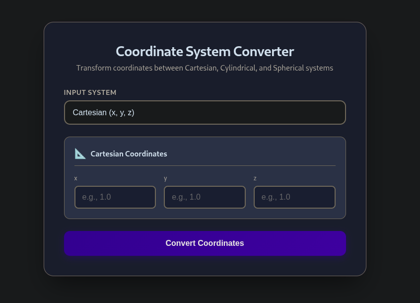
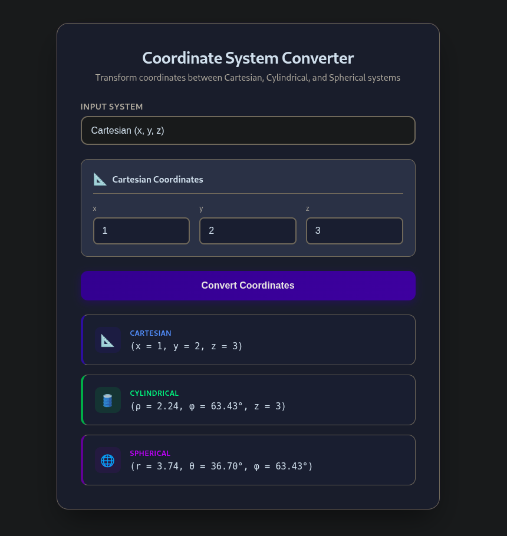

<h1 align="center">Coordinate System Converter</h1>

<p align="center">
  <strong>A secure, browser-based 3D coordinate converter</strong><br/>
  Cartesian • Cylindrical • Spherical
</p>

<p align="center">
  <a href="https://developer.mozilla.org/en-US/docs/Web/HTML">
    
  </a>
  <a href="https://developer.mozilla.org/en-US/docs/Web/CSS">
    
  </a>
  <a href="https://developer.mozilla.org/en-US/docs/Web/JavaScript">
    
  </a>
</p>

---

## Live Demo


#### https://feartheploto.github.io/coordinate-system-converter/

---

## Supported Coordinate Systems

- Cartesian (x, y, z)
- Cylindrical (ρ, φ, z)
- Spherical (r, θ, φ)

---
## App Preview

<div align="center">
  <table>
    <tr>
      <td align="center"><strong>System Selection</strong></td>
      <td align="center"><strong>Input Fields</strong></td>
      <td align="center"><strong>Converted Results</strong></td>
    </tr>
    <tr>
      <td></td>
      <td></td>
      <td></td>
    </tr>
  </table>
</div>

---

## Learning Goals

- Practice front-end development with vanilla JavaScript
- Apply safe DOM update patterns (XSS-aware coding)
- Validate and constrain user input
- Understand common client-side security risks
- Build maintainable UI logic without frameworks

---

## Security Considerations

- User input is never injected as raw HTML
- DOM updates rely on safe text-based rendering
- Input constraints reduce malformed input vectors
- Project designed with **XSS awareness** in mind

> ⚠️ This is an educational project focused on secure coding practices.

---

## Project structure

```structure
em-coordinate-converter/
├── index.html 
├── styles.css 
├── script.js 
├── screenshots/
│         ├── select_system.png
│         ├── input_fields.png
│         └── results.png
│
├── README.md
└── LICENSE
```

---


> Clean structure. No frameworks. No magic. Just Electrical Fields, logic, and secure front-end code.
